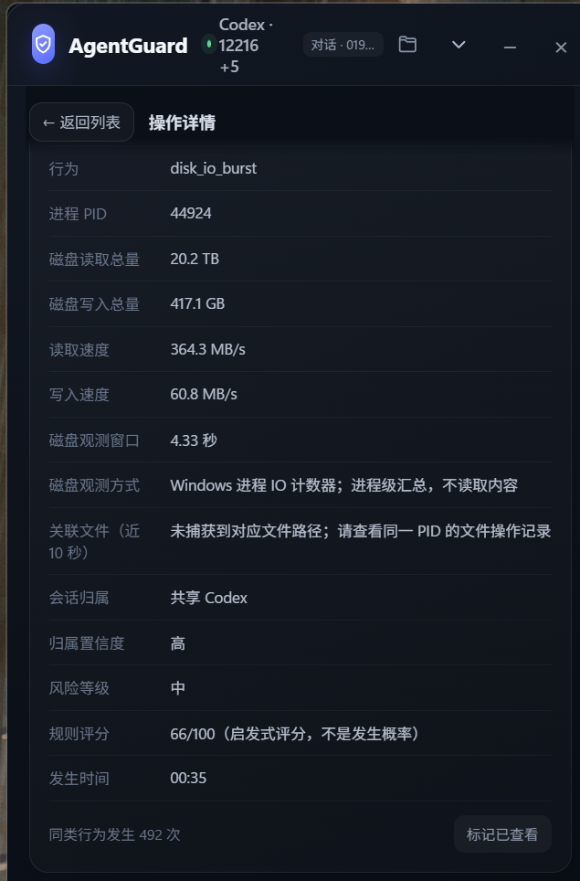

<div align="center">

# 🛡️ AgentGuard

### See what your coding agent is doing — without reading what you write.

Local, metadata-only observability for Codex, Claude Code, Gemini CLI, Aider,
Cursor Agent, Cline, Goose, and custom coding agents.

<p>
  
  
  
  
</p>

<p><strong>Process trees · File I/O · Network access · System changes · Risk screening</strong></p>

<p>
  <a href="#-quick-start"><strong>Try it in 60 seconds →</strong></a>
  &nbsp;·&nbsp;
  <a href="https://github.com/DDai22/CodexMonitor/issues">Report an issue</a>
  &nbsp;·&nbsp;
  <a href="README.zh-CN.md">中文说明</a>
</p>

<p>
  
</p>

<sub>Live operation detail preview · English UI is available with <code>--language en</code></sub>

[Quick start](#-quick-start) · [What it sees](#-what-it-sees) · [Privacy model](#-privacy-model)

</div>

---

## Why AgentGuard?

Coding agents are powerful because they can explore files, launch tools, call
the network, and change the operating system. The normal workflow is useful —
but it is often invisible.

AgentGuard adds a small, always-on-top lens over that workflow:

> **Observe the action. Keep the content private. Explain the signal.**

It does not proxy traffic, inject into the agent, read file contents, block
actions, or pretend to be a security boundary.

### Built for the moment that matters

```text
  “Why did the agent touch that file?”
  “Which process opened the connection?”
  “Was this my conversation or another one?”

                         AgentGuard answers with metadata.
```

## ✨ What it sees

| Surface | Examples | Collection style |
| --- | --- | --- |
| 🧩 **Agent lineage** | Root PID, child tools, working directory, conversation attribution | Process metadata |
| 📁 **File activity** | Create, modify, delete, rename, read, external paths | Windows ETW + metadata |
| 🌐 **Network** | Endpoints, DNS clues, TLS metadata, byte counters, rates | Socket/ETW metadata |
| ⚙️ **System** | Registry, services, startup, tasks, firewall, proxy, certificates | Metadata only |
| 🧠 **Privacy signals** | Credential locations, clipboard sequence changes, privacy commands | No content capture |
| 📊 **Resources** | CPU, memory, process bursts, bulk file behavior, disk-I/O bursts | Process counters |

Every event is screened into a simple, explainable posture:

- 🟢 **Normal** — expected local work and ordinary agent activity.
- 🟡 **Needs attention** — a rule detected a meaningful combination of signals.
- 🔴 **High risk** — destructive, sensitive, persistence, injection, or
  correlated bulk-read/archive/upload behavior.

The score is a heuristic rule score — **not a probability**.

## 🔎 A view, not a vault

```text
  Agent process
       │
       ├── child tools ────────┐
       ├── file events ────────┤
       ├── network metadata ───┤──> local event timeline
       └── system signals ─────┘          │
                                          └──> explainable screening
```

The UI keeps the small things quiet and brings the important thing forward:

1. **Compact strip** — agent status, conversation hint, and counters.
2. **Operation list** — normal, attention, reviewed, and category views.
3. **Full detail** — PID, attribution, paths, byte counts, rates, observation
   method, rule score, and related metadata.

## 🚀 Quick start

### The shortest path to a useful signal

```powershell
python -m pip install -e .
python -m agentguard discover
python -m agentguard ui --root D:\path\to\workspace --language en
```

Open an operation card and you can inspect its PID, session attribution,
conversation ID when available, path, byte counts, rates, observation method,
and explainable rule score.

### Requirements

- Windows 10/11
- Python 3.10+
- WebView2 runtime for the floating UI
- Administrator privileges for some Windows telemetry sources

### Install

```powershell
python -m pip install -e .
```

### Discover running agents

```powershell
python -m agentguard discover
```

### Start the floating monitor

```powershell
# Chinese UI (default)
python -m agentguard ui --root D:\path\to\workspace

# English UI
python -m agentguard ui --root D:\path\to\workspace --language en
```

The helper script can restart the window in either language:

```powershell
.\restart-agentguard.ps1 en
```

Focus on one agent process when needed:

```powershell
python -m agentguard ui --root D:\path\to\workspace --pid 12345 --language en
```

For a terminal-only run:

```powershell
python -m agentguard monitor --root D:\path\to\workspace
```

Events and summaries are written to `.agentguard/runs/`. Use
`--no-command-lines` when process arguments may contain sensitive material.

## 🧵 Conversation-aware attribution

Parallel coding-agent conversations should not collapse into one mystery box.
AgentGuard distinguishes:

- **Current conversation** — the conversation ID matches the monitor context.
- **Other conversation** — another parallel agent session, still logged but
  separable from the current one.
- **Shared agent** — the monitored agent root/shared process without a distinct
  thread ID.
- **Unconfirmed workspace** — useful workspace context without exact thread
  identity.

When Windows exposes a conversation ID, the UI shows it. Conversation content
is never read.

The default process targets include Codex, Claude Code, Gemini CLI, Aider,
Cursor Agent, Cline, and Goose. Add any other executable without changing the
collector:

```powershell
python -m agentguard ui --targets my-agent.exe --language en
```

## 🕵️ Privacy model

AgentGuard is intentionally metadata-only:

- ❌ No file contents collected by ETW.
- ❌ No network payload capture or decryption.
- ❌ No clipboard contents.
- ❌ No prompt or conversation content.
- ❌ No agent modification, proxying, blocking, or sandboxing.
- ✅ Paths, PIDs, timestamps, byte counts, rates, and event relationships.

Exact file paths associated with a resource anomaly are best-effort
correlations with recent file events. Process-level disk counters may include
I/O for paths that were not observed by ETW.

## ⚡ Designed for daily use

The monitor spreads work across event-driven and low-rate samplers:

| Sampler | Typical cadence |
| --- | ---: |
| File / registry ETW | Event-driven |
| Process discovery | ~1.5 s |
| Network sampling | Up to 1 s |
| Open-handle fallback | ~5 s |
| Resource / system samplers | ~2 s |
| Large workspace scan | ETW fallback instead of full walks |

This is a visibility layer for normal workflows — not a tamper-resistant
security control.

## 🧪 Development

```powershell
python -m compileall agentguard
python -m unittest discover -s tests -v
```

Contributions are welcome. Please keep new collectors observation-only and
avoid adding unnecessary collection of contents, credentials, or payloads.

## 🗺️ Roadmap

- [x] Process and child-tool attribution
- [x] Workspace and external file metadata
- [x] Network endpoint and byte observability
- [x] Explainable automatic screening
- [x] English floating UI
- [ ] Linux/macOS collector backends
- [ ] Pluggable policy packs
- [ ] Export adapters for local dashboards

## License

MIT — see [LICENSE](LICENSE).

<div align="center">

**AgentGuard — make agent activity visible, keep user data private.**

</div>
